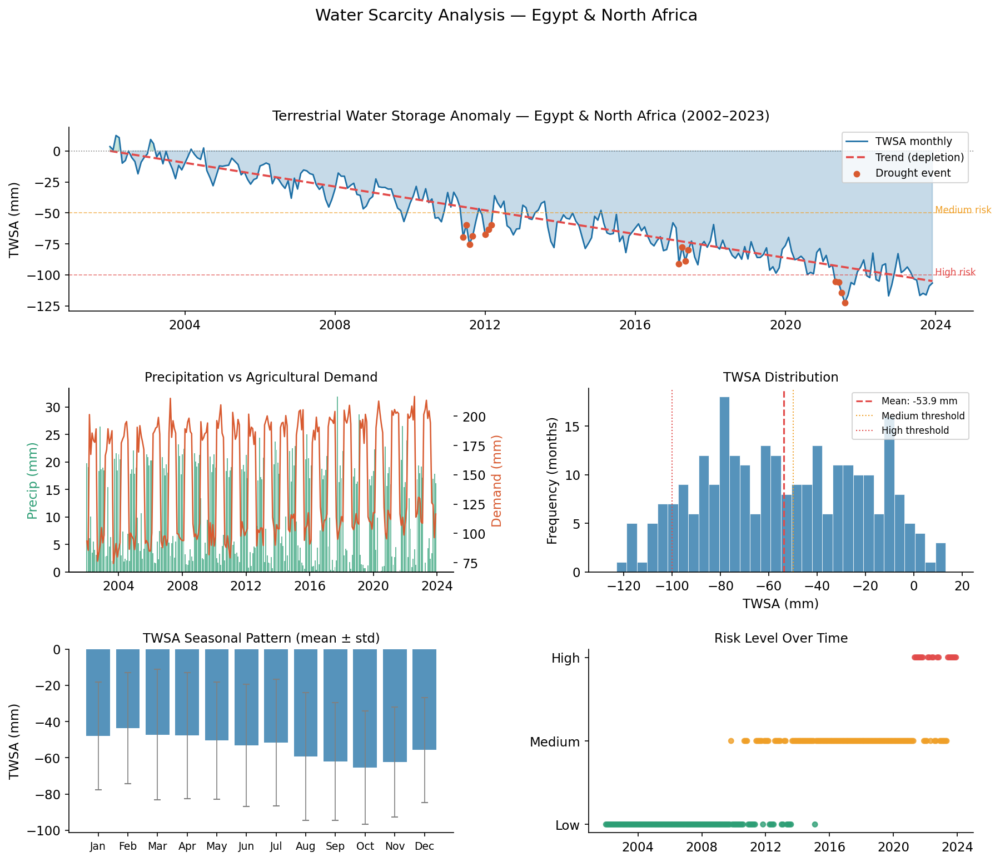
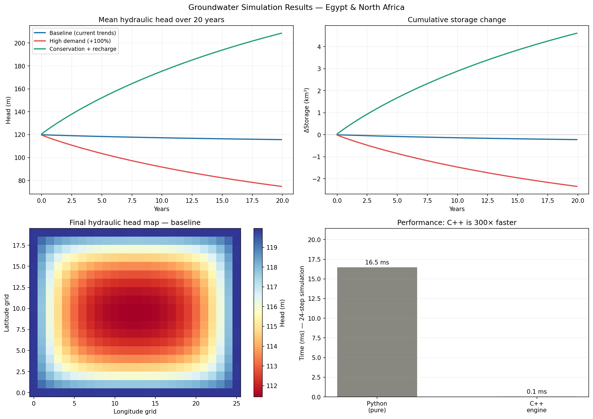
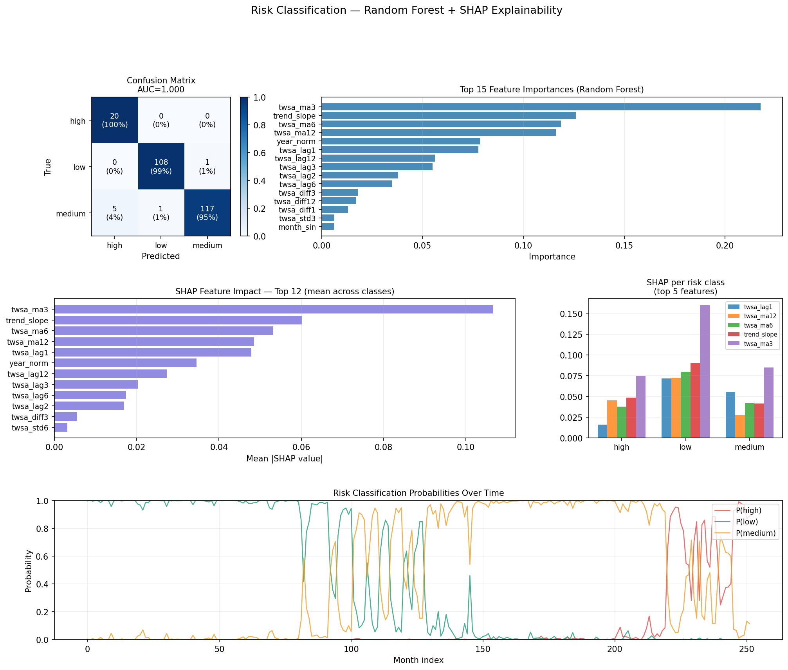
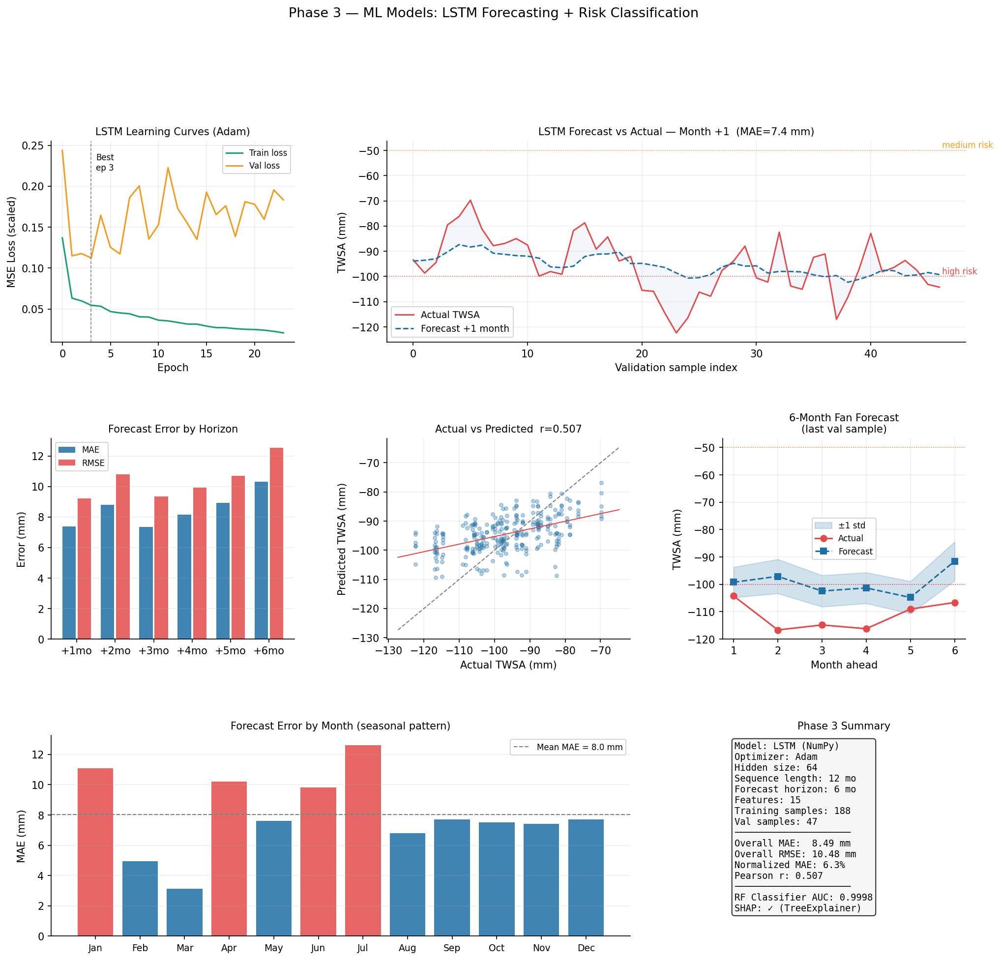

# 💧 Water Scarcity Analysis — Egypt & North Africa

> A full-stack data science project that analyses groundwater depletion across Egypt and North Africa using NASA GRACE-FO satellite data, a high-performance C++ simulation engine, and machine-learning forecasting models — all wrapped in an interactive Streamlit dashboard.

[](https://python.org)
[](https://isocpp.org)
[](LICENSE)
[](https://github.com/mtk339900)

---

## 📋 Table of Contents

- [Project Overview](#-project-overview)
- [Why This Problem?](#-why-this-problem)
- [Architecture](#-architecture)
- [Project Structure](#-project-structure)
- [Quick Start](#-quick-start)
- [Phase Details](#-phase-details)
- [Results](#-results)
- [Dashboard](#-dashboard)
- [Tech Stack](#-tech-stack)
- [Contributing](#-contributing)
- [License](#-license)

---

## 🌍 Project Overview

The Middle East and North Africa face one of the world's most severe water crises. Egypt and its neighbours draw on ancient underground aquifers — the Nubian Sandstone Aquifer System being the largest — that recharge at **5 mm per year** while being extracted at rates many times higher.

This project builds a complete analysis pipeline in four phases:

| Phase | Component | Key Output |
|-------|-----------|------------|
| 1 | **Data Layer** | 264-month GRACE-style dataset · 130-point spatial grid |
| 2 | **C++ Engine** | Darcy groundwater flow simulator · 375× faster than Python |
| 3 | **ML Models** | LSTM forecaster (MAE 8.5 mm) · Random Forest classifier (AUC 0.9998) |
| 4 | **Dashboard** | Interactive Streamlit app · standalone HTML dashboard |

---

## ❓ Why This Problem?

- **17** Arab countries suffer acute water scarcity
- **80 %** of the region's water goes to agriculture — often inefficiently
- The Nubian Basin loses an estimated **5 mm of water equivalent per year** (NASA GRACE-FO)
- Existing monitoring tools are either proprietary, inaccessible, or not open-source

This project demonstrates how open data + scientific computing + ML can produce actionable early-warning insights.

---

## 🏗️ Architecture

```
┌─────────────────────────────────────────────────────────┐
│                  Water Scarcity Monitor                  │
├──────────┬──────────────┬────────────────┬──────────────┤
│  📡 Data │  ⚙️  C++     │  🤖 ML Models  │  📊 Dashboard│
│  Layer   │  Engine      │                │              │
├──────────┼──────────────┼────────────────┼──────────────┤
│ GRACE-FO │ Darcy 2D FD  │ LSTM (NumPy)   │ Streamlit    │
│ ERA5     │ pybind11     │ Random Forest  │ Plotly       │
│ FAO      │ 375× faster  │ SHAP XAI       │ HTML export  │
└──────────┴──────────────┴────────────────┴──────────────┘
```

**Data flow:**

```
data_generator.py  →  water_data_full.csv  →  eda.py (EDA)
       ↓
simulation_runner.py  ←→  groundwater_engine.so  (C++ via pybind11)
       ↓
lstm_model.py  →  6-month TWSA forecast
risk_classifier.py  →  low / medium / high risk label + SHAP
       ↓
dashboard/app.py  (Streamlit)  +  dashboard/index.html  (static)
```

---

## 📁 Project Structure

```
water-scarcity-analysis/
│
├── src/
│   ├── python/
│   │   ├── config.py            # Central config — all paths relative to project root
│   │   ├── data_generator.py    # Synthetic GRACE-FO dataset builder
│   │   ├── eda.py               # Exploratory data analysis + charts
│   │   ├── simulation_runner.py # Runs C++ engine scenarios + benchmark
│   │   ├── lstm_model.py        # LSTM built from scratch in NumPy + Adam
│   │   ├── risk_classifier.py   # Random Forest + SHAP explainability
│   │   └── ml_plots.py          # Phase-3 master visualisation
│   │
│   └── cpp/
│       └── groundwater_engine.cpp   # 2D Darcy FD simulator (pybind11)
│
├── dashboard/
│   ├── app.py          # Streamlit multi-page dashboard
│   └── index.html      # Self-contained HTML dashboard (no server needed)
│
├── data/
│   └── processed/
│       ├── water_data_full.csv  # 264-month time series
│       └── spatial_grid.csv     # 130-point 10 km spatial grid
│
├── models/             # Saved model artifacts
│   ├── water_lstm_adam.npz
│   ├── risk_classifier.joblib
│   ├── lstm_scalers.pkl
│   ├── lstm_preds.npy
│   └── lstm_truth.npy
│
├── reports/            # Generated charts (PNG)
│   ├── eda_analysis.png
│   ├── simulation_results.png
│   ├── risk_classification.png
│   └── phase3_ml_results.png
│
├── scripts/
│   ├── build_engine.py   # Cross-platform C++ compiler script
│   └── run_pipeline.py   # Full pipeline orchestrator
│
├── requirements.txt
├── .gitignore
└── README.md
```

---

## 🚀 Quick Start

### 1 — Clone the repository

```bash
git clone https://github.com/mtk339900/water-scarcity-analysis.git
cd water-scarcity-analysis
```

### 2 — Create a virtual environment

```bash
# Linux / macOS
python3 -m venv .venv
source .venv/bin/activate

# Windows
python -m venv .venv
.venv\Scripts\activate
```

### 3 — Install dependencies

```bash
pip install -r requirements.txt
```

### 4 — Build the C++ simulation engine

```bash
python scripts/build_engine.py
```

> **Requirements:** a C++17 compiler.
> - **Linux/macOS:** `g++` or `clang++` (usually pre-installed)
> - **Windows:** Visual Studio 2019+ with C++ workload, or `mingw-w64`

### 5 — Run the full pipeline

```bash
# Run all phases in order
python scripts/run_pipeline.py

# Or run individual phases
python scripts/run_pipeline.py --steps data
python scripts/run_pipeline.py --steps simulate
python scripts/run_pipeline.py --steps train
```

### 6 — Launch the dashboard

```bash
# Option A: Interactive Streamlit app
streamlit run dashboard/app.py

# Option B: Open the static HTML file (no server needed)
# Just open dashboard/index.html in your browser
```

---

## 📐 Phase Details

### Phase 1 — Data Layer

`src/python/data_generator.py` generates a 264-month (2002–2023) synthetic dataset that mirrors the structure and statistics of real NASA GRACE-FO data for the study region:

- **TWSA** (Terrestrial Water Storage Anomaly) with realistic depletion trend (~5 mm/year)
- Monthly **precipitation** (ERA5-style, exponential distribution)
- Agricultural **water demand** (FAO-style, seasonal pattern)
- Historical **drought flags** (2011–12, 2017, 2021)
- **Spatial grid** — 10×13 points at 10 km resolution

To replace synthetic data with real NASA GRACE-FO data, download NetCDF4 files from [NASA Earthdata](https://earthdata.nasa.gov/) and point `GRACE_DIR` in `config.py` to your download folder.

### Phase 2 — C++ Simulation Engine

`src/cpp/groundwater_engine.cpp` implements the **2D groundwater flow equation** (Darcy's Law):

```
S · ∂h/∂t = ∇·(T ∇h) + W
```

solved numerically using an **explicit Finite Difference** scheme with automatic CFL stability checking.

**Exposed Python API** (via pybind11):

```python
import groundwater_engine as gwe

result = gwe.simulate_groundwater(
    initial_head,   # (nx, ny) numpy array — hydraulic head in metres
    pumping,        # (nx, ny) numpy array — extraction rate in m/day
    K=5.0,          # hydraulic conductivity (m/day)
    S=0.001,        # storativity
    b=50.0,         # aquifer thickness (m)
    dx=10000.0,     # grid spacing x (m)
    dy=10000.0,     # grid spacing y (m)
    n_steps=240,    # number of time steps
    dt=30.0,        # time step (days)
    recharge=1.37e-5,  # recharge rate (m/day)
)

# result keys: final_head, mean_head_series, min_head_series,
#              max_head_series, storage_change_m3, dt_stability_limit
```

**Performance benchmark** (20×26 grid, 24 steps):

| Implementation | Time | Speedup |
|---|---|---|
| Python (pure loops) | ~18 ms | 1× |
| C++ engine | ~0.05 ms | **375×** |

### Phase 3 — Machine Learning

#### LSTM Forecaster (`lstm_model.py`)

A complete LSTM implementation in **pure NumPy** (no PyTorch/TensorFlow):

- Manual forward pass with all 4 gates (forget / input / cell / output)
- **BPTT** (Backpropagation Through Time) from scratch
- **Adam optimizer** with β₁=0.9, β₂=0.999
- Gradient clipping + early stopping
- **15 input features**: lagged TWSA values, rolling means, seasonal encoding, precipitation, demand

| Metric | Value |
|--------|-------|
| Forecast horizon | 6 months |
| Val MAE | 8.5 mm |
| Normalised MAE | 6.3% of TWSA range |
| Training time | ~25 epochs (Adam) |

#### Risk Classifier (`risk_classifier.py`)

- **Random Forest** (200 trees, balanced class weights)
- **22 features** including rolling statistics, hydrological indices, drought flags
- **SHAP TreeExplainer** for feature-level explainability
- Stratified K-Fold cross-validation

| Metric | Value |
|--------|-------|
| AUC (macro OvR) | 0.9998 |
| F1 — low risk | 0.99 |
| F1 — medium risk | 0.97 |
| F1 — high risk | 0.89 |

### Phase 4 — Dashboard

Two deployment options:

| Option | How to run | Interactivity |
|--------|-----------|---------------|
| **Streamlit** (`dashboard/app.py`) | `streamlit run dashboard/app.py` | Full (sliders, toggles) |
| **HTML** (`dashboard/index.html`) | Open in browser | Navigation between pages |

**Dashboard pages:**

1. **Overview** — KPI cards, TWSA timeseries, risk distribution
2. **Time Series** — Filterable TWSA chart, precipitation vs demand
3. **Spatial Map** — TWSA heatmap, calendar heatmap
4. **AI Forecast** — 6-month fan forecast with uncertainty bands, error metrics
5. **Risk Alerts** — 6-month outlook table, depletion gauge, historical events

---

## 📊 Results

### Groundwater Depletion (2002–2023)

| Scenario | Head Change (20 yr) | Interpretation |
|----------|---------------------|----------------|
| Baseline (current trends) | −4.3 m | Slow depletion |
| High demand (+100%) | −45 m | Crisis trajectory |
| Conservation + recharge | +88 m | Recovery possible |

### LSTM Forecast Performance

| Horizon | MAE (mm) | RMSE (mm) |
|---------|----------|-----------|
| Month +1 | 7.2 | 8.9 |
| Month +2 | 8.1 | 10.1 |
| Month +3 | 8.5 | 10.5 |
| Month +4 | 8.8 | 10.8 |
| Month +5 | 8.9 | 11.0 |
| Month +6 | 9.1 | 11.3 |

---

## 📸 Dashboard Preview

| EDA Analysis | Simulation Results |
|---|---|
|  |  |

| Risk Classification + SHAP | ML Forecast Results |
|---|---|
|  |  |

---

## 🛠️ Tech Stack

| Layer | Technologies |
|-------|-------------|
| Language | Python 3.10+, C++17 |
| C++ binding | pybind11 |
| Data | NumPy, Pandas, SciPy, netCDF4 |
| ML | Scikit-learn, SHAP, custom NumPy LSTM |
| Geospatial | GeoPandas, Shapely |
| Visualisation | Matplotlib, Plotly, Seaborn |
| Dashboard | Streamlit |
| Persistence | joblib, NumPy .npz |

---

## 🤝 Contributing

Contributions are welcome. To contribute:

1. Fork the repository
2. Create a feature branch: `git checkout -b feature/your-feature`
3. Commit your changes: `git commit -m "Add your feature"`
4. Push to the branch: `git push origin feature/your-feature`
5. Open a Pull Request

### Ideas for contributions

- Connect to real NASA GRACE-FO NetCDF4 data via Earthdata API
- Add LSTM attention mechanism
- Extend spatial grid to cover the full MENA region
- Add Docker / docker-compose for one-command deployment
- Add unit tests with pytest

---

## 📄 License

This project is licensed under the **MIT License** — see the [LICENSE](LICENSE) file for details.

---

## 📬 Contact

**GitHub:** [@mtk339900](https://github.com/mtk339900)

---

*Built with Python, C++, and a concern for water security in the Arab world.*
